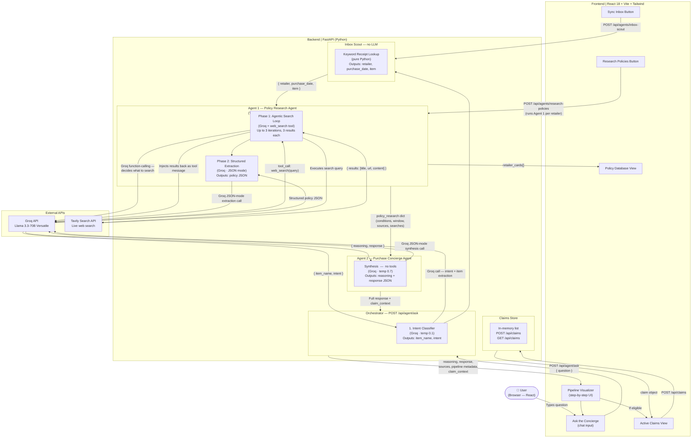
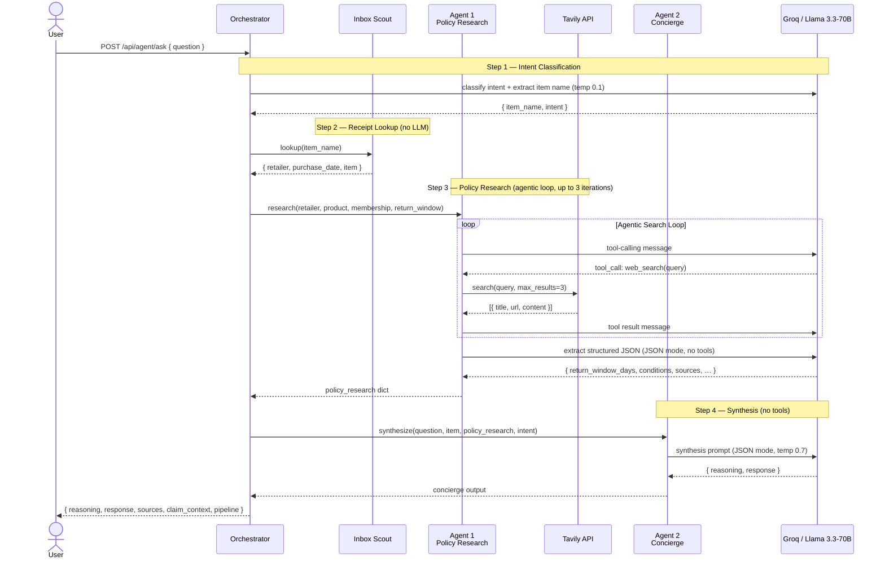
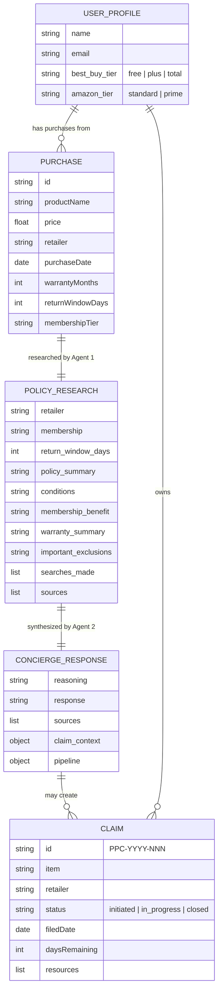

# PPC — Agent Architecture Diagram

> Render this file in GitHub, VS Code (Markdown Preview), or any Mermaid-compatible viewer to see the diagram.

---

## System Overview

---

## Fixed Pipeline — Step-by-Step

---

## Data Schemas

---

## Agent Roles Summary

| Component | Type | LLM | Tool Access | Input | Output |
|---|---|---|---|---|---|
| **Orchestrator** | Controller | Groq (intent only) | None | User question | Directs pipeline |
| **Inbox Scout** | Data retrieval | None | None | Item name | Receipt data |
| **Agent 1 — Policy Research** | Tool-using Executor | Groq (× up to 4 calls) | `web_search` via Tavily | Retailer, product, membership | Structured policy JSON + sources |
| **Agent 2 — Purchase Concierge** | Domain Expert / Explainer | Groq (× 1 call) | None | Question + policy research | `reasoning` + `response` |
